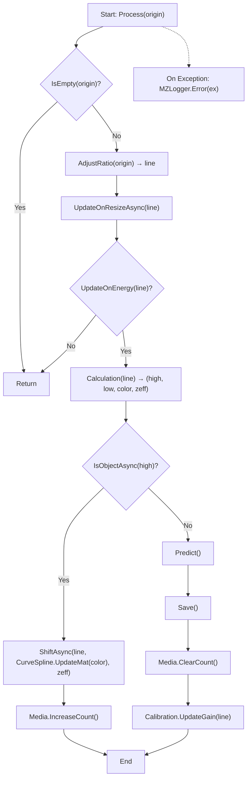
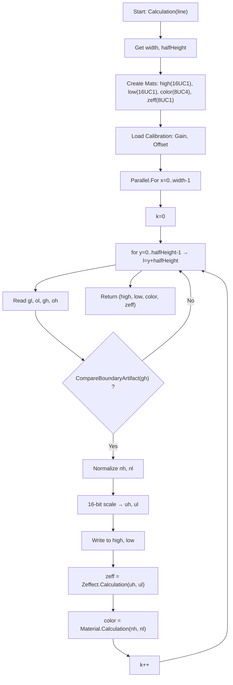
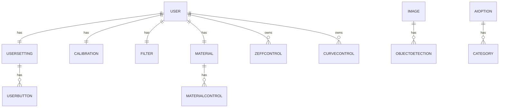

# MZ.Xray.Prism

## 1. 프로젝트 개요

### 1.1 목적

> 🚀 **이 프로젝트는 산업용 X-ray 경험을 바탕으로, 인공지능과 결합했을 때 필요한 기능 개발에 초점을 맞추고 있습니다.**  

### 1.2 시연 영상

> 클릭 시 YouTube에서 전체 영상 재생

<a href="https://www.youtube.com/watch?v=uLTVRcM9iZM" target="_blank">
   
</a>

### 1.3 특징

- **실시간 영상 스트림** 처리 파이프라인
- **AI 추론**(객체 탐지) 모듈화
- **DB 저장** 기반 결과 관리
- **Calibration & LUT Curve**를 이용한 물성 분석

### 1.4 환경 요구 사항

- **OS**: Windows 10/11
- **.NET**: 8 LTS
- **IDE**: Visual Studio 2022 (Desktop development with .NET)
- **AI**: ONNX Runtime(CUDA)
- **GPU**: CUDA 12.x, cuDNN 9.x
- **라이브러리**: WPF, Prism, OpenCV-Sharp, Serilog, LiveChartCore

### 1.5 기술 스택

- AI 모델 형식: **YOLOv11**
- 데이터 형식: **16bit grayscale / dual-energy X-ray raw**
- 통신 프로토콜: TCP Socket
- 데이터베이스: SQLite(Local)
- 로깅: Serilog (rolling file)
- 배포: MSI Installer

### 1.6 주요 기능

- **사용자 관리**: 로그인 / 회원가입
- **실환경 X-ray 형식 송수신**
    - unsafe pointer 기반 데이터를 네트워크 소켓으로 실시간 전송
- **하단(Footer) 버튼**
    - **픽커(Picker)**: 버튼 On/Off에 따른 표시 여부
    - **시작/정지**: X-ray 제어
    - **이전/이후**: 프레임 이동
    - **색상 모드**: Gray / Color / Organic / Inorganic / Metal
    - **줌**: 중앙 기준 확대/축소
    - **필터**: 밝기 / 대조 / 초기화
    - **인공지능**: On/Off
    - **Zeffect**: 물성 분석 결과 색상 표시
    - **캡처**: UI 화면 캡처
    - **설정**: Footer 버튼 표시 제어
- **상단(Menu) 버튼**
    - 색상 정보(Material)
    - LUT Curve 편집
    - AI 카테고리 관리
    - 보고서(PDF 저장 가능)
    - 이미지 저장소
    - 로그 저장소
    - 테마(White/Dark)
    - 사용자 정보(사용 시간 표시)

#### 1.7 구성
- 프로젝트 디렉터리 구조

```
MZ.Xray.Prism/
├─ Application/        # UI, 시각화, 설정 관리, 실시간 모니터링 (Prism MVVM)
├─ Producer/           # 입력 → 전처리 → 데이터 송신 (가상 장비 송신부)
├─ UnitTest/           # 핵심 알고리즘/서비스 단위 테스트
└─ .github/workflows/  # CI/CD (빌드·테스트 자동화)
```

---

## 2.1 데이터 처리 파이프라인

### 실시간 이미지 처리



**처리 단계**

1. **입력 검증**: 데이터 없는 라인은 즉시 반환(연산 절약)
2. **보정**: 픽셀 비율·해상도 조정
3. **상태 갱신**: Gain/Offset 기반 에너지 상태 갱신
4. **계산**: High, Low, Color, Zeff 생성
5. **물체 검출**
    - 검출됨: 라인 이동 + 데이터 갱신
    - 미검출: AI 추론 + 결과 저장 + Gain 업데이트

---

### 이미지 색상 처리 (Calculation)



---

## 3. 데이터베이스 설계



**주요 엔티티**

- **User**: 계정 정보, 권한, 생성·로그인 시각
- **UserSetting**: 사용자 UI 설정, 다국어, 버튼 가시성
- **Image**: X-ray 이미지 메타데이터
- **AIOption**: 모델 경로, GPU 설정, 추론 파라미터
- **Material**: 색상·투명도·밀도 파라미터
- **Calibration**: Gain/Offset, Threshold, Artifact 설정
- **ZeffectControl**: 물성 기반 색상 표시 규칙
- **CurveControl**: LUT 곡선 제어점
- **ObjectDetection**: 추론 결과(BBox, Score, Label)

---

## 4. 서비스 계층

- **DatabaseService**
    - User, AppSetting, Image, Filter, Material, Calibration, ZeffectControl, CurveControl, AIOption 서비스 집합
- **UserService**
    - Login, Logout, Register, 설정 변경/조회, 권한 확인
- **AppSettingService**
    - Register(단일 레코드 유지), GetAppSetting
- **XrayAIOptionService**
    - Create(정책 보장), Save(카테고리 동기화), Load/Delete
- **XrayVisionImageService**
    - 이미지 로드(기간·페이지·리포트), 저장(ObjectDetection 포함)
- **XrayVisionCalibrationService / FilterService / MaterialService**
    - 사용자별 로드/저장, MaterialControl 동기화
- **XrayVisionZeffectControlService / CurveControlService**
    - 사용자별 로드/저장, Zeffect(추가/삭제/수정), Curve(전체 재등록)
