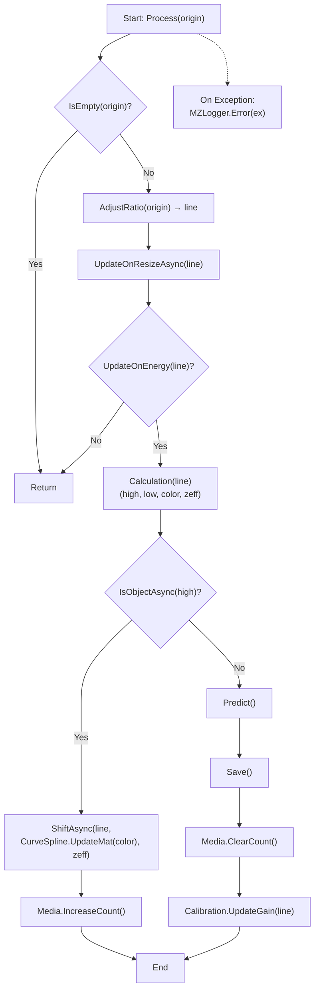
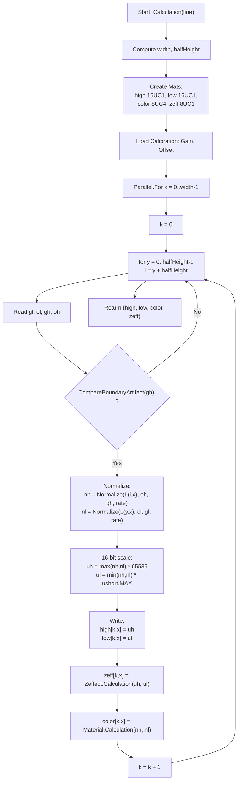

# MZ.Xray.Prism

### 1. 프로젝트 개요

#### 시연 영상
프로젝트 동작 예시를 영상으로 확인할 수 있습니다.  
[](https://www.youtube.com/watch?v=uLTVRcM9iZM)  
> 클릭하면 YouTube로 이동하여 전체 영상을 재생합니다.

#### 목적
- 생산 라인/연구 장비 등에서 X-ray 영상을 자동으로 분석해 위험 물품을 검출

#### 특징
- 실시간 영상 스트림 처리(프레임 파이프라인)
- AI 추론(객체 탐지) 모듈화
- 결과 저장(DB)
- 룰 기반 검사 로직(Calibration & LUT Curve)

#### 환경 요구 사항
- OS: Windows 10/11, .NET 8 LTS
- IDE: Visual Studio 2022, Desktop development with .NET 
- AI : ONNX Runtime(CUDA), 
- GPU: CUDA 12.x, cuDNN 9.x
- Library : WPF, Prism, OpenCV-Sharp, Serilog,  LiveChartCore

#### 기술 스택 세부 정보
- AI 모델 형식: YOLOv11
- 데이터 형식: 16bit grayscale / dual-energy X-ray raw format
- 네트워크 프로토콜: TCP Socket
- DB: SQLite(Local)
- 로그 관리: Serilog, rolling file
- 배포 방식: MSI Installer

#### 기능 
- 로그인 및 회원가입 기능
- 실환경 Xray형식과 동일한 파일 네트워크 통신 수행
   - 실환경은 (unsafe)Pointer 형식임으로 해당 데이터를 네트워크 소켓으로 전송하여 실시간 처리로 구성
- 하단(Footer) 버튼 기능 설명
   - 픽커(Picker) : 기능 제어를 위한 버튼, 해당 버튼이 On/Off에 따라 화면에서 하단 버튼이 보이는 여부를 확인
   - 시작/정지(Play/Stop) : Xray 제어 수행 (시작/정지)
   - 이전/이후(Prev/Next) : 1 Frame 이전, 이후 이동
   - 색상 : Gray, Color, 유기물(Organic), 무기물(Inorganic), 금속(Metal) 표현
   - 줌 : 화면의 중앙을 기점으로 확대/축소
   - 필터 : 밝기(Bright), 대조(Contrast) 및 필터 초기화
   - 인공지능 : On/Off를 통해 UI 에 표현
   - Zeffect : 물성 분석 알고리즘을 통해 해당 범위를 색상으로 표현
   - 캡쳐 : ui 화면 캡쳐 수행
   - 설정 : Footer 버튼 (보이기/숨기기)
- 상단(Menu) 버튼 설명
   - 색상 정보(Material) : 이중에너지에 대한 색상값을 수치화하여 표현하기 위함
   - 색상 곡선(LUT Curve) : 화면에 표기된 Xray 색상을 그래프를 통해 제어 수행
   - 인공지능 카테고리 관리(AI) : 인공지능 모델의 카테고리 정보 수정 및 제어 가능
   - 보고서(Report) : 해당 모델이 예측된 결과를 기간별로 검색이 가능하며, PDF 파일을 통해 분석 결과 표현
   - 이미지 저장소(Image Storage) : 저장된 이미지 목록을 검색 및 확인 가능
   - 로그 저장소(Log Storage) : 로그 정보 저장
   - 태마 색상(theme) : White/Dark 태마 설정
   - 사용자 정보 : 현 사용자가 소프트웨어 사용 시간 표현

### 2. 아키텍처

```text
MZ.Xray.Prism/
├─ Application/
├─ Producer/
├─ UnitTest/
├─ .github/
   └─ workflows/
```

- Application : 운영 UI, 시각화, 설정 관리, 실시간 상태 모니터링(Prism MVVM)
- Producer : 입력→전처리→데이터 송신, 가상의 장비(Detector)의 송신부 구현
- UnitTest : 핵심 알고리즘/서비스 단위 테스트
- .github/workflows(CI/CD) : 빌드/테스트 자동화 워크플로우(Git Action)

#### 2.1 데이터 처리 파이프라인(이미지)

- 데이터 수집
   - Producer에서 raw frame(16cu1)을 실시간 소켓 통신 수행
   - unsafe pointer를 Mat으로 변환
 
##### 실시간 이미지 처리


##### 이미지 색상 처리 (Process)
1. 입력 검증: 비어있는 라인(데이터 없음)은 즉시 반환하여 불필요한 연산 방지
2. 보정/비율 조정: 라인의 픽셀 비율과 해상도 보정
3. 에너지 상태 갱신: Gain/Offset 기반 상태 갱신
4. 색상/물성 계산: 듀얼에너지 기반으로 Color/Zeff 계산
5. 결과 생성: High, Low, Color, Zeff 이미지 생성
6. 물체 판단: 고신호(High)를 이용해 물체 존재 여부 판단
7. 물체 식별 시: 라인을 이동(Shift)하고 색상/물성 데이터 갱신 
8. 물체 비식별 시: AI 추론을 수행하고 결과/이미지 저장 및 Gain 업데이트

##### 이미지 색상 처리



##### 세부 연산 (Calculation)
1. 기본 설정: width, halfHeight를 계산하고 출력 버퍼 생성
2. high, low: 16UC1 / color: 8UC4 / zeff: 8UC1
3. 보정 파라미터 로드: 행 단위 Gain, Offset 호출
4. 열 단위 병렬 처리: x = 0..width-1 범위를 병렬 처리
5. 상·하 신호 매핑: 각 y = 0..halfHeight-1에 대해 l = y + halfHeight로 High/Low 위치 지정
6. 경계 검사: CompareBoundaryArtifact(gh)가 참거짓 판단
7. 정규화:
   - nh = Normalize(L(l,x), oh, gh, rate)
   - nl = Normalize(L(y,x), ol, gl, rate)
8. High/Low 값 확정(16-bit):
   - uh = max(nh, nl) * ushort.MAX
   - ul = min(nh, nl) * ushort.MAX
9. 버퍼 기록: high[k,x] = uh, low[k,x] = ul
10. Zeff 계산(8-bit): zeff[k,x] = Zeffect.Calculation(uh, ul)
11. 컬러 매핑(RGBA): color[k,x] = Material.Calculation(nh, nl)
12. 라인 인덱스 진척: k = k + 1로 출력 라인 진행
13. 반환: (high, low, color, zeff)을 반환

### 3. 엔티티 

```
User (1) ──── (1) UserSetting ── (N) UserButton
   │
   ├──── (1) Calibration
   ├──── (1) Filter
   ├──── (1) Material ─── (N) MaterialControl
   ├──── (N) ZeffectControl
   └──── (N) CurveControl

AIOption (1) ─── (N) Category

Image (1) ─── (N) ObjectDetection
```

#### 3.1 데이터 처리 파이프라인(엔티티)

